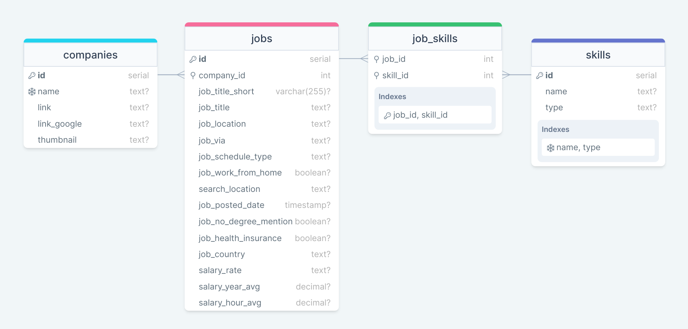
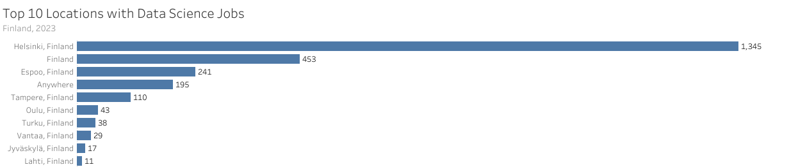
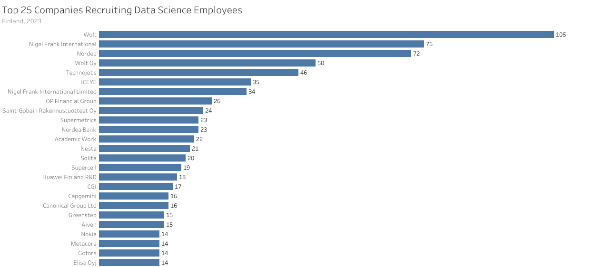
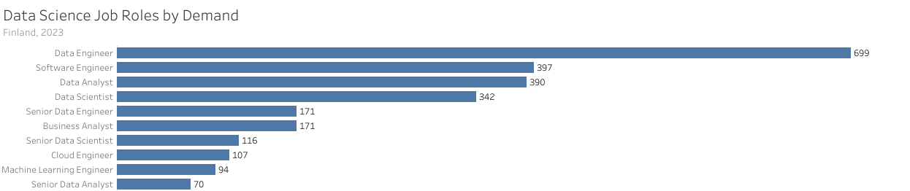
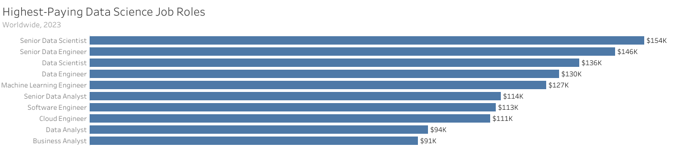
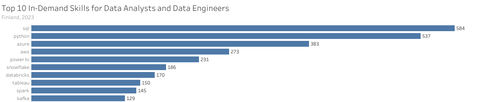
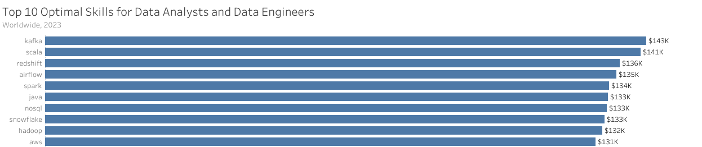

# Analyzing Jobs Postings in Data Science with SQL

[SQL for Data Analytics](https://www.lukebarousse.com/sql) Capstone Project by [Markku Laine](https://markkulaine.com) (2024)


## Overview

There are 2,557 data science jobs in Finland.

**Questions:**

1. Which cities have the most data science jobs in Finland?
2. Which companies recruit the most data science employees in Finland?
3. What are the most in-demand data science jobs in Finland?
4. What are the highest-paying data science jobs in ~~Finland~~ the world?
5. What are the most in-demand skills for Data Analysts and Data Engineers in Finland?
6. What are the most optimal skills to learn for Data Analysts and Data Engineers in ~~Finland~~ the world?


**Tools:** [SQL](https://en.wikipedia.org/wiki/SQL), [PostgreSQL](https://www.postgresql.org/), [DrawSQL](https://drawsql.app/), [Visual Studio Code](https://code.visualstudio.com/) (with [SQLTools](https://marketplace.visualstudio.com/items?itemName=mtxr.sqltools) extension), [Tableau](https://www.tableau.com/), [Docker Compose](https://docs.docker.com/compose/), [git](https://git-scm.com/), [GitHub](https://github.com/)


## Dataset

This project uses a modified version of the original [Job Postings in 2023](https://lukeb.co/sql_project_csvs) dataset from Luke Barousse's [SQL for Data Analytics](https://www.lukebarousse.com/sql) course. The [dataset](./dataset/) consists of four CSV files, each representing a table in the *Job Postings* database: companies (140,033 rows), job_skills (3,669,604 rows), jobs (787,686 rows), and skills (256 rows).



*Figure: An ER diagram of the Job Postings database*


## Analysis

### 1. Which cities have the most data science jobs in Finland?

```sql
SELECT
  job_location AS location,
  COUNT(*) AS job_count
FROM
  jobs
WHERE
  job_country = 'Finland'
GROUP BY
  job_location
ORDER BY
  job_count DESC, location
LIMIT
  10;
```



*Figure: Top 10 locations with data science jobs in Finland, 2023*

<!--
| Location           | Job Count |
| :----------------- | --------: |
| Helsinki, Finland  |     1,345 |
| Finland            |       453 |
| Espoo, Finland     |       241 |
| Anywhere           |       195 |
| Tampere, Finland   |       110 |
| Oulu, Finland      |        43 |
| Turku, Finland     |        38 |
| Vantaa, Finland    |        29 |
| Jyväskylä, Finland |        17 |
| Lahti, Finland     |        11 |
-->


### 2. Which companies recruit the most data science employees in Finland?

```sql
SELECT
  name AS company,
  COUNT(*) AS job_count
FROM
  companies AS c
LEFT JOIN
  jobs AS j ON c.id = j.company_id
WHERE
  job_country = 'Finland'
GROUP BY
  name
ORDER BY
  job_count DESC, name
LIMIT
  25;
```



*Figure: Top 25 companies recruiting data science employees in Finland, 2023*

<!--
| Company                           | Job Count |
| :-------------------------------- | --------: |
| Wolt                              |       105 |
| Nigel Frank International         |        75 |
| Nordea                            |        72 |
| Wolt Oy                           |        50 |
| Technojobs                        |        46 |
| ICEYE                             |        35 |
| Nigel Frank International Limited |        34 |
| OP Financial Group                |        26 |
| Saint-Gobain Rakennustuotteet Oy  |        24 |
| Nordea Bank                       |        23 |
| Supermetrics                      |        23 |
| Academic Work                     |        22 |
| Neste                             |        21 |
| Solita                            |        20 |
| Supercell                         |        19 |
| Huawei Finland R&D                |        18 |
| CGI                               |        17 |
| Canonical Group Ltd               |        16 |
| Capgemini                         |        16 |
| Aiven                             |        15 |
| Greenstep                         |        15 |
| Elisa Oyj                         |        14 |
| Gofore                            |        14 |
| Metacore                          |        14 |
| Nokia                             |        14 |
-->


### 3. What are the most in-demand data science jobs in Finland?

```sql
SELECT
  job_title_short AS role,
  COUNT(*) AS job_count
FROM
  jobs
WHERE
  job_country = 'Finland'
GROUP BY
  job_title_short
ORDER BY
  job_count DESC;
```



*Figure: Data science job roles by demand in Finland, 2023*

<!--
| Role                      | Job Count |
| :------------------------ | --------: |
| Data Engineer             |       699 |
| Software Engineer         |       397 |
| Data Analyst              |       390 |
| Data Scientist            |       342 |
| Business Analyst          |       171 |
| Senior Data Engineer      |       171 |
| Senior Data Scientist     |       116 |
| Cloud Engineer            |       107 |
| Machine Learning Engineer |        94 |
| Senior Data Analyst       |        70 |
-->


### 4. What are the highest-paying data science jobs in ~~Finland~~ the world?

```sql
SELECT
  job_title_short AS role,
  COUNT(salary_year_avg) AS job_count,
  ROUND(AVG(salary_year_avg), 0) AS average_salary,
  ROUND(MIN(salary_year_avg), 0) AS min_salary,
  ROUND(MAX(salary_year_avg), 0) AS max_salary
FROM
  jobs
WHERE
  --  job_country = 'Finland' AND
  salary_year_avg IS NOT NULL
GROUP BY
  job_title_short
ORDER BY
  average_salary DESC;
```



*Figure: Highest-paying data science job roles worldwide, 2023*

<!--
| Role                      | Job Count | Average Salary ($) | Min Salary ($) | Max Salary ($) |
| :------------------------ | --------: | -----------------: | -------------: | -------------: |
| Senior Data Scientist     |     1,686 |            154,050 |         45,000 |        890,000 |
| Senior Data Engineer      |     1,594 |            145,867 |         35,000 |        425,000 |
| Data Scientist            |     5,926 |            135,929 |         27,000 |        960,000 |
| Data Engineer             |     4,509 |            130,267 |         15,000 |        525,000 |
| Machine Learning Engineer |       573 |            126,786 |         30,000 |        325,000 |
| Senior Data Analyst       |     1,132 |            114,104 |         30,000 |        425,000 |
| Software Engineer         |       469 |            112,778 |         28,000 |        375,000 |
| Cloud Engineer            |        65 |            111,268 |         42,000 |        280,000 |
| Data Analyst              |     5,463 |             93,876 |         25,000 |        650,000 |
| Business Analyst          |       617 |             91,071 |         16,500 |        387,460 |
-->


### 5. What are the most in-demand skills for Data Analysts and Data Engineers in Finland?

```sql
SELECT
  name AS skill,
  type,
  COUNT(*) AS job_count
FROM
  jobs AS j
INNER JOIN
  job_skills AS js ON j.id = js.job_id
INNER JOIN
  skills AS s ON js.skill_id = s.id
WHERE
  job_country = 'Finland' AND
  job_title_short in ('Data Analyst', 'Data Engineer')
GROUP BY
  type, name
ORDER BY
  job_count DESC
LIMIT
  10;
```



*Figure: Top 10 in-demand skills for Data Analysts and Data Engineers in Finland, 2023*

<!--
| Skill      | Type          | Job Count |
| :--------- | :------------ | --------: |
| sql        | programming   |       584 |
| python     | programming   |       537 |
| azure      | cloud         |       383 |
| aws        | cloud         |       273 |
| power bi   | analyst_tools |       231 |
| snowflake  | cloud         |       186 |
| databricks | cloud         |       170 |
| tableau    | analyst_tools |       150 |
| spark      | libraries     |       145 |
| kafka      | libraries     |       129 |
-->


### 6. What are the most optimal skills to learn for Data Analysts and Data Engineers in ~~Finland~~ the world?

```sql
SELECT
  name AS skill,
  type,
  COUNT(*) AS job_count,
  ROUND(AVG(salary_year_avg), 0) AS average_salary
FROM
  jobs AS j
INNER JOIN
  job_skills AS js ON j.id = js.job_id
INNER JOIN
  skills AS s ON js.skill_id = s.id
WHERE
  -- job_country = 'Finland' AND
  job_title_short in ('Data Analyst', 'Data Engineer') AND
  salary_year_avg IS NOT NULL
GROUP BY
  type, name
HAVING
  COUNT(*) > 500
ORDER BY
  average_salary DESC,
  job_count DESC
LIMIT
  10;
```



*Figure: Top 10 optimal skills for Data Analysts and Data Engineers worldwide, 2023*

<!--
| Skill     | Type        | Job Count | Average Salary ($) |
| --------- | ----------- | --------- | ------------------ |
| kafka     | libraries   |       912 |            142,512 |
| scala     | programming |       853 |            141,246 |
| redshift  | cloud       |       870 |            136,262 |
| airflow   | libraries   |       808 |            135,427 |
| spark     | libraries   |     1,774 |            133,697 |
| java      | programming |     1,289 |            133,423 |
| nosql     | programming |       930 |            133,270 |
| snowflake | cloud       |     1,313 |            132,681 |
| hadoop    | libraries   |       979 |            132,134 |
| aws       | cloud       |     2,291 |            130,563 |
-->


## Conclusions

Todo
