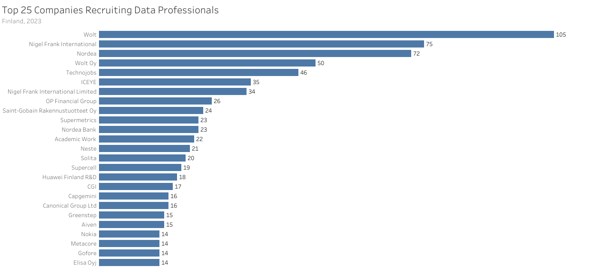

# Analyzing Jobs Postings in Data Science with SQL

[SQL for Data Analytics](https://www.lukebarousse.com/sql) Capstone Project by [Markku Laine](https://markkulaine.com) (2024)


## Overview

The goal of this project is to explore the data science job market in Finland by analyzing job postings published in 2023 using SQL.

**The questions I wanted answers to are:**

1. Which cities have the most data science jobs in Finland?
2. Which companies recruit the most data professionals in Finland?
3. What are the most in-demand data science job roles in Finland?
4. What are the highest-paying data science job roles in [~~Finland~~](## "Unfortunately, the dataset had only limited data points available for Finland.") the world?
5. What are the most in-demand skills for Data Analysts and Data Engineers in Finland?
6. What are the most optimal skills to learn for Data Analysts and Data Engineers in [~~Finland~~](## "Unfortunately, the dataset had only limited data points available for Finland.") the world?


**Tools:** [SQL](https://en.wikipedia.org/wiki/SQL), [PostgreSQL](https://www.postgresql.org/), [DrawSQL](https://drawsql.app/), [Visual Studio Code](https://code.visualstudio.com/) (with [SQLTools](https://marketplace.visualstudio.com/items?itemName=mtxr.sqltools) extension), [Tableau](https://www.tableau.com/), [Docker Compose](https://docs.docker.com/compose/), [git](https://git-scm.com/), [GitHub](https://github.com/)


## Dataset

This project uses a modified version of the original [Job Postings in 2023](https://lukeb.co/sql_project_csvs) dataset from Luke Barousse's [SQL for Data Analytics](https://www.lukebarousse.com/sql) course. The [dataset](./dataset/) consists of four CSV files, each representing a table in the *Job Postings* database (see the ER diagram below): companies (140,033 rows), job_skills (3,669,604 rows), jobs (787,686 rows), and skills (256 rows).


## Analysis

### 1. Which cities have the most data science jobs in Finland?

To identify the largest data science hubs in Finland, I filtered jobs by country and then grouped them by location.

```sql
SELECT
  job_location AS location,
  COUNT(*) AS job_count
FROM
  jobs
WHERE
  job_country = 'Finland'
GROUP BY
  job_location
ORDER BY
  job_count DESC, location
LIMIT
  10;
```


<!--
| Location           | Job Count |
| :----------------- | --------: |
| Helsinki, Finland  |     1,345 |
| Finland            |       453 |
| Espoo, Finland     |       241 |
| Anywhere           |       195 |
| Tampere, Finland   |       110 |
| Oulu, Finland      |        43 |
| Turku, Finland     |        38 |
| Vantaa, Finland    |        29 |
| Jyväskylä, Finland |        17 |
| Lahti, Finland     |        11 |
-->

Insights:

- **Helsinki** dominates the data science job market in Finland with 1,345 job postings, reflecting its status as the country's capital and major economic hub.
- **Espoo** and **Tampere**, the second and third largest cities in Finland, feature 241 and 110 job postings, respectively. Both cities have a university of technology, which likely increases the number of tech companies and the demand for data professionals in the region.
- Data science job opportunies are also abundant in smaller cities around the country, exemplified by **Oulu** (43), **Jyväskylä** (17), and **Lahti** (11), as well as through **remote positions (Anywhere)**, accounting for 195 job postings.


### 2. Which companies recruit the most data professionals in Finland?

To identify the biggest recruiters in Finland, I joined companies with the jobs data and then filtered and grouped them by country and company, respectively.

```sql
SELECT
  name AS company,
  COUNT(*) AS job_count
FROM
  companies AS c
LEFT JOIN
  jobs AS j ON c.id = j.company_id
WHERE
  job_country = 'Finland'
GROUP BY
  name
ORDER BY
  job_count DESC, name
LIMIT
  25;
```



<!--
| Company                           | Job Count |
| :-------------------------------- | --------: |
| Wolt                              |       105 |
| Nigel Frank International         |        75 |
| Nordea                            |        72 |
| Wolt Oy                           |        50 |
| Technojobs                        |        46 |
| ICEYE                             |        35 |
| Nigel Frank International Limited |        34 |
| OP Financial Group                |        26 |
| Saint-Gobain Rakennustuotteet Oy  |        24 |
| Nordea Bank                       |        23 |
| Supermetrics                      |        23 |
| Academic Work                     |        22 |
| Neste                             |        21 |
| Solita                            |        20 |
| Supercell                         |        19 |
| Huawei Finland R&D                |        18 |
| CGI                               |        17 |
| Canonical Group Ltd               |        16 |
| Capgemini                         |        16 |
| Aiven                             |        15 |
| Greenstep                         |        15 |
| Elisa Oyj                         |        14 |
| Gofore                            |        14 |
| Metacore                          |        14 |
| Nokia                             |        14 |
-->

Insights:

- **Wolt** leads with 155 job postings, signaling its strong emphasis on data-driven decision-making in the food delivery industry.
- Technology recruitment companies such as **Nigel Frank International** (109), **Technojobs** (46), and **Academic Work** (22) are heavily represented on the list, indicating a rising demand for data professionals across various sectors.
- Financial institutions like **Nordea Bank** (95) and **OP Financial Group** (26) actively seek data professionals, highlighting the ever-growing role of data analytics in the banking and finance sectors.


### 3. What are the most in-demand data science job roles in Finland?

To identify the most demanded job roles in Finland, I filtered jobs by country and then grouped them by role.

```sql
SELECT
  job_title_short AS role,
  COUNT(*) AS job_count
FROM
  jobs
WHERE
  job_country = 'Finland'
GROUP BY
  job_title_short
ORDER BY
  job_count DESC;
```


<!--
| Role                      | Job Count |
| :------------------------ | --------: |
| Data Engineer             |       699 |
| Software Engineer         |       397 |
| Data Analyst              |       390 |
| Data Scientist            |       342 |
| Business Analyst          |       171 |
| Senior Data Engineer      |       171 |
| Senior Data Scientist     |       116 |
| Cloud Engineer            |       107 |
| Machine Learning Engineer |        94 |
| Senior Data Analyst       |        70 |
-->

Insights:

- **(Senior) Data Engineer** roles are the most in-demand in Finland, with 870 job postings, indicating that there is a high demand for data professionals to build and maintain automated data processing pipelines and data storage systems within organizations.
- **(Senior) Data Analyst** and **(Senior) Data Scientist** positions are also highly sought-after, with 460 and 458 job postings respectively, suggesting a growing need for professionals skilled in data analysis and advanced data modeling techniques.
- **Software Engineer** roles follow closely behind, with 397 job postings, highlighting the intersection of software development and data science in the Finnish job market.


### 4. What are the highest-paying data science job roles in ~~Finland~~ the world?

To identify the highest-paying job roles in [~~Finland~~](## "Unfortunately, the dataset had only limited data points available for Finland.") the world, I grouped jobs having salary information by role and then computed their average yearly salary.

```sql
SELECT
  job_title_short AS role,
  COUNT(salary_year_avg) AS job_count,
  ROUND(AVG(salary_year_avg), 0) AS average_salary,
  ROUND(MIN(salary_year_avg), 0) AS min_salary,
  ROUND(MAX(salary_year_avg), 0) AS max_salary
FROM
  jobs
WHERE
  --  job_country = 'Finland' AND
  salary_year_avg IS NOT NULL
GROUP BY
  job_title_short
ORDER BY
  average_salary DESC;
```


<!--
| Role                      | Job Count | Average Salary ($) | Min Salary ($) | Max Salary ($) |
| :------------------------ | --------: | -----------------: | -------------: | -------------: |
| Senior Data Scientist     |     1,686 |            154,050 |         45,000 |        890,000 |
| Senior Data Engineer      |     1,594 |            145,867 |         35,000 |        425,000 |
| Data Scientist            |     5,926 |            135,929 |         27,000 |        960,000 |
| Data Engineer             |     4,509 |            130,267 |         15,000 |        525,000 |
| Machine Learning Engineer |       573 |            126,786 |         30,000 |        325,000 |
| Senior Data Analyst       |     1,132 |            114,104 |         30,000 |        425,000 |
| Software Engineer         |       469 |            112,778 |         28,000 |        375,000 |
| Cloud Engineer            |        65 |            111,268 |         42,000 |        280,000 |
| Data Analyst              |     5,463 |             93,876 |         25,000 |        650,000 |
| Business Analyst          |       617 |             91,071 |         16,500 |        387,460 |
-->

Insights:

- **Experience:** Senior-level Data Scientists ($154K), Data Engineers ($146K), and Data Analysts ($114K) enjoy average yearly salaries that are 12-21% higher than those of their less seasoned peers, underscoring the importance of experience and skills in data science.
- **Skills:** Roles demanding a diverse set of skills, such as Data Scientist, Data Engineer, and Machine Learning Engineer are generally associated with higher annual salaries.


### 5. What are the most in-demand skills for Data Analysts and Data Engineers in Finland?

To identify the most in-demand skills for Data Analysts and Data Engineers in Finland, I joined jobs with the associated skills data and then filtered them by country and role, and finally grouped skills by their id.

```sql
SELECT
  name AS skill,
  type,
  COUNT(*) AS job_count
FROM
  jobs AS j
INNER JOIN
  job_skills AS js ON j.id = js.job_id
INNER JOIN
  skills AS s ON js.skill_id = s.id
WHERE
  job_country = 'Finland' AND
  job_title_short in ('Data Analyst', 'Data Engineer')
GROUP BY
  s.id
ORDER BY
  job_count DESC
LIMIT
  10;
```


<!--
| Skill      | Type          | Job Count |
| :--------- | :------------ | --------: |
| sql        | programming   |       584 |
| python     | programming   |       537 |
| azure      | cloud         |       383 |
| aws        | cloud         |       273 |
| power bi   | analyst_tools |       231 |
| snowflake  | cloud         |       186 |
| databricks | cloud         |       170 |
| tableau    | analyst_tools |       150 |
| spark      | libraries     |       145 |
| kafka      | libraries     |       129 |
-->

Insights:

- **Programming:** SQL and Python top the list, with 584 and 537 job postings respectively, highlighting the importance of programming proficiency in both Data Analyst and Data Engineer roles.
- **Cloud:** Cloud-related skills such as Azure, AWS, and Snowflake are in high demand, with 383, 273, and 186 job postings respectively, indicating a growing reliance on cloud-based data solutions and infrastructure among Finnish companies.
- **Analyst tools:** Mastering tools like Power BI (231) and Tableau (150) are essential especially for Data Analysts, suggesting a strong emphasis on data visualization for effective analysis and decision-making.
- **Libraries:** Open-source libraries such as Apache Spark and Apache Kafka are also notable, with 145 and 129 job postings respectively, underscoring the importance of these technologies for data processing and streaming tasks among Data Engineers in Finland.


### 6. What are the most optimal skills to learn for Data Analysts and Data Engineers in ~~Finland~~ the world?

To identify the most optimal skills to learn for Data Analysts and Data Engineers in [~~Finland~~](## "Unfortunately, the dataset had only limited data points available for Finland.") the world, I joined jobs having salary information with the associated skills data and then filtered them by role, and finally grouped popular skills by their id.

```sql
SELECT
  name AS skill,
  type,
  COUNT(*) AS job_count,
  ROUND(AVG(salary_year_avg), 0) AS average_salary
FROM
  jobs AS j
INNER JOIN
  job_skills AS js ON j.id = js.job_id
INNER JOIN
  skills AS s ON js.skill_id = s.id
WHERE
  -- job_country = 'Finland' AND
  job_title_short in ('Data Analyst', 'Data Engineer') AND
  salary_year_avg IS NOT NULL
GROUP BY
  s.id
HAVING
  COUNT(*) > 500
ORDER BY
  average_salary DESC,
  job_count DESC
LIMIT
  10;
```


<!--
| Skill     | Type        | Job Count | Average Salary ($) |
| --------- | ----------- | --------- | ------------------ |
| kafka     | libraries   |       912 |            142,512 |
| scala     | programming |       853 |            141,246 |
| redshift  | cloud       |       870 |            136,262 |
| airflow   | libraries   |       808 |            135,427 |
| spark     | libraries   |     1,774 |            133,697 |
| java      | programming |     1,289 |            133,423 |
| nosql     | programming |       930 |            133,270 |
| snowflake | cloud       |     1,313 |            132,681 |
| hadoop    | libraries   |       979 |            132,134 |
| aws       | cloud       |     2,291 |            130,563 |
-->

Insights:

- **Programming:** Proficiency in less popular programming languages for data science such as Scala and Java show significant demand, which is reflected in their relatively higher average yearly salaries reaching up to $141K and $133K, respectively.
- **Cloud:** Skills related to cloud platforms and services like Redshift, Snowflake, and AWS are in high demand, offering lucrative average yearly salaries ranging from $131K to $136K.
- **Libraries:** Mastery of Apache Kafka ($143K), Airflow ($135K), Spark ($134K), and Hadoop ($132K) is also highly valued, highlighting their significance in data engineering roles worldwide.


## Conclusions

In 2023, a total of 2,557 data science job postings were published in Finland. The following summarizes the insights derived from the data analysis:

1. **Largest data science hubs:** Large cities like Helsinki, Tampere, and Espoo boast with many data science job opportunities, but smaller cities such as Jyväskylä and Lahti also offer considerable employment opportunities in the field in addition to remote positions.
2. **Biggest recruiters:** Wolt is Finland's biggest recruiter in the field of data science with 155 job postings, followed by major technology recruitment firms, financial institutions, and tech companies.
3. **Most in-demand roles:** In Finland, the most in-demand roles include (Senior) Data Engineer, (Senior) Data Analyst, (Senior) Data Scientist, and Software Engineer, suggesting a growing need for data professionals capable of working at the intersection of data science and software development.
4. **Highest-paying roles:** Experienced data professionals, such as Senior-level Data Scientists and Data Engineers, enjoy higher average yearly salaries, reflecting the value placed on both experience and diverse skills in the *global* job market.
5. **Most in-demand skills:** In Finland, SQL and Python proficiency is crucial for Data Analyst and Data Engineer roles, while demand for cloud skills like Azure and AWS is rising, alongside essential data analytics tools and libraries, such as Power BI and Apache Spark.
6. **Most optimal skills:** Proficiency in Scala and Java programming languages commands high salaries in the *global* job market, as do cloud skills like Redshift, Snowflake, and AWS, along with mastery of various Apache libraries for data engineering.

In summary, the Finnish job market for data science looks very promising, with large urban centers serving as hubs for opportunities. Wolt emerges as a major player in recruitment, while demand remains high for experienced data professionals adept in diverse skills and technologies.
